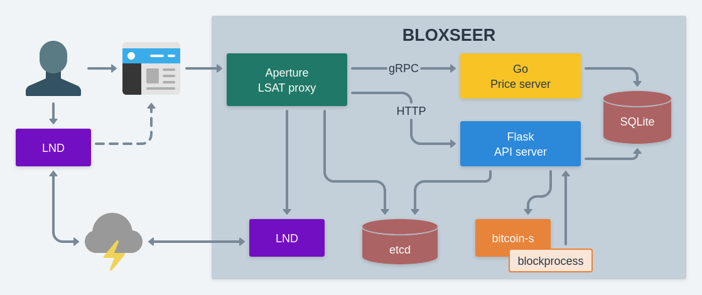

# bloxseer

_Chain-data DLC Oracle-as-a-Service API Server_

**This project is incomplete! Alpha release development is underway.**

## Overview

Bloxseer is an oracle management server for discreet log contract (DLC)
events derived from Bitcoin blockchain data. It runs behind an
[Aperture](https://github.com/lightninglabs/aperture) reverse proxy that
facilitates authentication and collection of [Lightning
Network](http://lightning.network/) payments using
[LSATs](https://lsat.tech).

The API server is written in Python using the
[Flask](https://flask.palletsprojects.com/) framwork. The Pricer gRPC
server will be written in Go (using static pricing to start). LSAT data
is stored in [etcd](https://etcd.io/), and DLC data will be stored in
[SQLite](https://sqlite.org/).

DLC operations and blockchain data gathering are managed by
[bitcoin-s](https://bitcoin-s.org/). Pollling is being used initially,
but eventually its `blockprocess` callback will be used to trigger new
block handling. For interfacing with the Lightning Network,
[LND](https://github.com/lightningnetwork/lnd) is used with a
[Neutrino](https://github.com/lightninglabs/neutrino) backend (external
LND required at this time).

High-level architecture:


---

## Alpha Release Functionality

The alpha release will be very limited in scope, primarily targeting
measurements of taproot adoption. A few other very simple measurements
may also be included.

- **Simple [enumerated
  outcomes](https://github.com/discreetlogcontracts/dlcspecs/blob/master/Oracle.md#simple-enumeration)**
  - All announcements will be simple yes/no (possible 3rd state for draw)
- Event duration: up to ~70 days
  - Start block should be at least 6 (up to 2016) blocks from chain tip
  - Maturation block should be within 10080 blocks of start block
  - Subject to change, depending on block processing and recommendations
    from the DLC experts
- Metrics available for attestation: under/over for...
  - Any [block stat]() for a specific block
  - Any block stat for a range of blocks (min, max, mean)
  - Transaction metrics
    - Percentage of inputs or outputs using taproot
    - Percentage with at least one taproot input/output/either
    - Percentage of blocks sending coinbase reward to a taproot output
  - Difficulty increased/decreased

### User Stories

Here are some potential use cases we are targetting for the alpha release:

> I believe there will be at least one block during the next difficulty
> adjustment period that sends its coinbase reward to a taproot output.

> I believe at least 25% of transaction outputs during the next month
> will be using taproot.

> I believe the difficulty of the next adjustment period will increase.

### Out of scope

The following items are desirable but will be deferred until beta or
later releases:

- [Digit decomposition
  outcomes](https://github.com/discreetlogcontracts/dlcspecs/blob/master/Oracle.md#digit-decomposition)
- Announcements for non-taproot transaction types
  - These should be straightforward to add, by duplicating the
    equivalent taproot events.
  - Only excluding them to limit repetition, to avoid unnecessary
    re-work if major changes are needed early on.
- Indexing chain data for faster retrieval
  - The initial event duration is limited to a duration that can be
    processed within one minute (or so) of polling bitcoind and
    processing the results.
- Trigger processing of a block as soon as it arrives
  - Since the initial event types are measured in days, polling is
    sufficent

---

## Usage

### Dev environment

[Polar](https://lightningpolar.com) is recommended for a quick and easy
way to manage a dev environment of regtest LND and bitcoind nodes. For a
detailed walkthrough, visit the [Builder's
Guide](https://docs.lightning.engineering/lapps/guides/polar-lapps/local-cluster-setup-with-polar)

Create a new simnet with 2 LND nodes and 1 bitcoind backend:
- `alice` is used by Aperture
- `bob` is used by the browser

Mine 100 blocks and fund both wallets, then open a channel from `bob`
to `alice`. Copy the macaroons and TLS cert from `alice` into the
`aperture/lnd` directory in this repo:

```
ALICE_LND_DIR="$HOME/.polar/networks/1/volumes/lnd/alice"
ALICE_MACAROON_DIR="$ALICE_LND_DIR/data/chain/bitcoin/regtest"
ALICE_TLS_CERT="$ALICE_LND_DIR/tls.cert"

cp "$ALICE_MACAROON_DIR"/{admin,invoice}".macaroon" $ALICE_TLS_CERT \
  aperture/lnd/
```

In `aperture/aperture.yaml` ensure that `authenticator.lndhost` is set
to the hostname and port where `alice` LND node is listening for gRPC.

Start the bloxseer stack with docker-compose:

```
docker-compose up
```

Now you can try the following endpoints:
- Homepage (Aperture static files): https://localhost:8080
- Events List: https://localhost:8080/event
- New Event: https://localhost:8080/new
  - Requires payment
- Price demo: https://localhost:8080/price
  - Allows 3 free requests, then requires payment

For a walkthrough of how to pay an LSAT invoice, and a deeper dive into
Aperture, watch Elle Mouton's [Aperture Dynamic Prices
Demo](https://www.youtube.com/watch?v=Y2ZG-qcw7Sw). You may also want to
try the [Alby](https://getalby.com/) browser extension.
